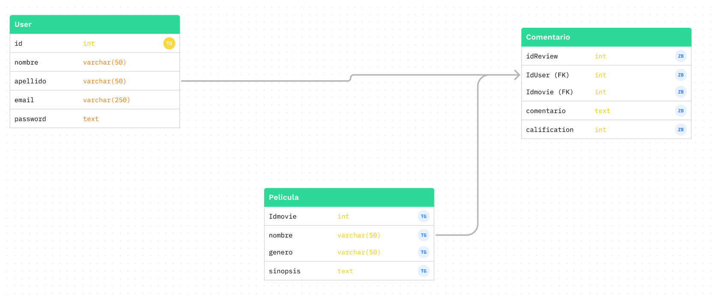

# Proyecto final F2 BEDU Backend

Este proyecto final del equpo 20 de la fase 2 del Bootcamp de Desarrollo Web.

## API  de Películas

En este proyecto se creó una API de reseñas de películas, en el siguiente esquema se muestra la estructura de la base de datos.

Esta base de datos se encuentra hosteada en Heroku.